<p class="description"></p>


<!-- more -->

## 故事起因

​	很喜欢网易云音乐，甚至剁手开了年费会员，我这么爱它，所以就很想破解它，控制不住自己，然后就有了这篇文章。

## 初步探索

### 寻找目标 URL

​	我随便找到一首歌，然后打开开发者工具，清空记录，按照下图设置：

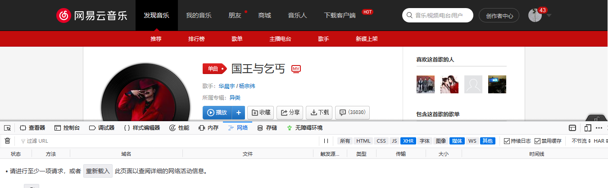

​	然后我点击网页的播放按钮，查看输出，等几秒之后，暂停播放，开始检查得到的 URL 及其响应结果，当我看到下图的 URL 时，已经可以确定这个就是我要找的目标 URL 了。

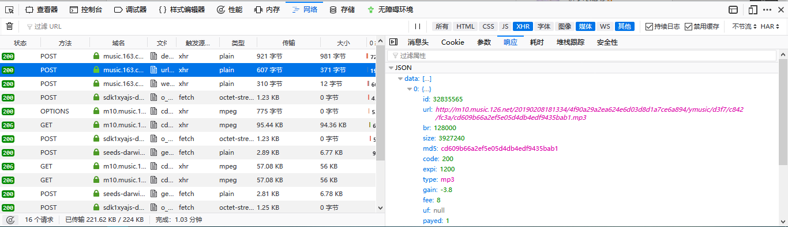

### 寻找目标 JS

​	和往常一样，我打开 URL 的参数检查，如下图所示。

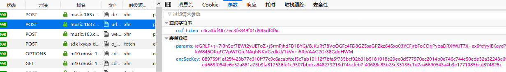

​	可以看到此 URL 有一个 csrf_token 查询字符串，以及两个需要 POST 的数据：params 和 encSecKey。

​	由于平时经常写爬虫，所以我对 URL 的查询字符串异常敏感，我尝试去掉 csrf_token 重新 POST，如图：

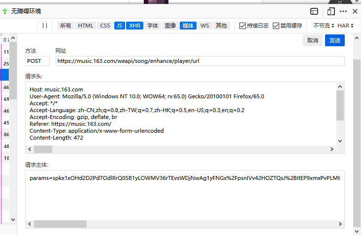

​	发现得到的结果和之前一样，故得出结论 csrf_token 这个东西没有用，我接着看两个 POST 的数据，按照以往的经验，这么长这么重要而且还是 POST，一定是经过 JS 加密的，所以我要找到那个目标 JS，但是假如盲目的寻找肯定找上几个小时也不得行，所以我选择“投机取巧”，直接搜索 表单的 key，搜索 params 得到了很多结果，所以我搜索的是 encSecKey，如图：

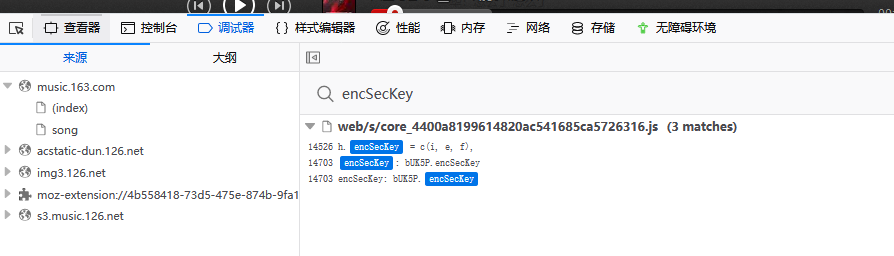

那么现在，我的目标 JS 也找到了

### 初步分析 JS

​	我打开 JS ，搜索 encSecKey，跳到图中位置：

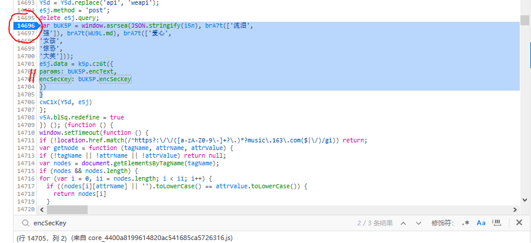

​	显然，我需要的两个参数都和 bUK5P 有关，所以我需要知道 bUK5P 是如何计算得到的，那么所有问题就都解决了，所以我在图六画圈的位置打了一个断点进行调试。

​	详细的调试技巧各位朋友如果不熟悉请自行谷歌，毕竟我最讨厌那些以干货自居的科普文了。

​	刷新网页，进入调试界面，点击恢复或者摁下 F8 ，然后一直点跨越或者步进或者 摁 F10/F11，直到当前代码运行位置到达断点之后的语句，如图：

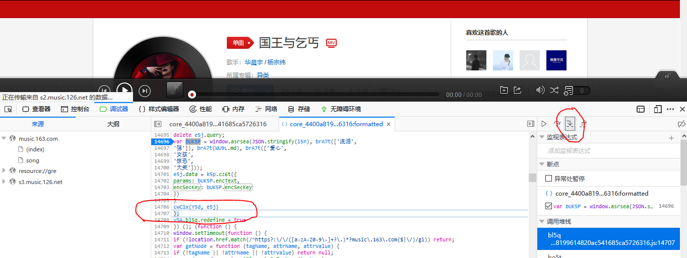

​	然后我进入 console 开始进一步检查，我依次向 console 发送图中的消息，得到的结果如图：

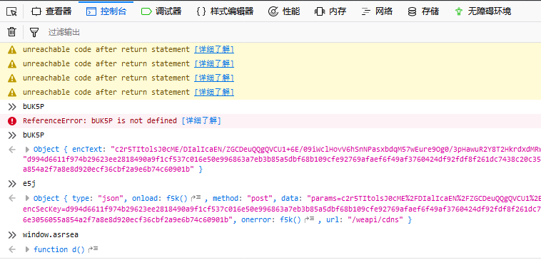

### 初步总结

​	根据以往的经验以及以上的初步分析，我得到以下结论，朋友们也可以认真思索一下：

> 1. encSecKey = bUK5P.encSecKey，params = bUK5P.encText
> 2. bUK5P 是由 函数 window.asrsea 计算得到的
> 3. e5j 是获取歌曲 URL 的详细方式
> 4. 函数 window.asrsea 需要 传入四个参数，具体四个参数的分析下面会接触到
> 5. 最关键的是**function d() 就是 函数 window.asrsea**

<hr/>

得到以上结论之后，我开始进行更加深入地探索

<hr/>

## 深入探索

### 分析参数

​	点击 console 的 function d()进入 d 在 JS 中的位置：


​	简单浏览函数可以看到：函数 d 调用了 a，b，c 三个函数，a，b，c 的内容如图：

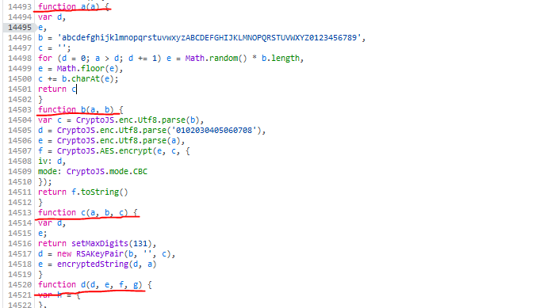

​	简单阅读代码可以知道：

> - 函数 a 是产生随机的16为字符串
> - 函数 b 是 AES 对称加密过程
> - 函数 c 是 RSA 非对称加密过程

​	看到这里，我的心里关于网易处理歌曲加载请求的流程已经有了一个大概，卖个关子，继续往下看。

​	为了详细的探索这四个函数首先我要知道函数 d 的四个参数都是什么，我依旧在图七中的位置打上断点：

1. 第一次经过断点，各个变量的值如图：

   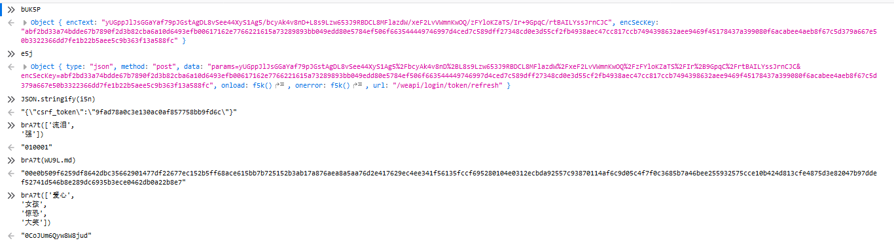

2. 第二次经过断点，各个变量值如图：

   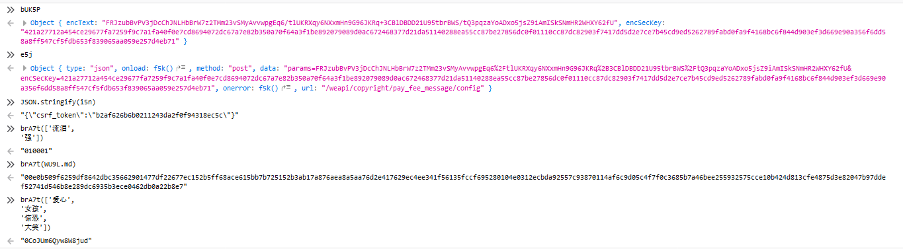

​	我得到结论：**传入函数 d 的四个参数都是常量**

### 分析函数

知道了参数是什么，我开始分析四个函数，我在图示的位置打上断点，至于为什么这么打，请朋友你自行思索：

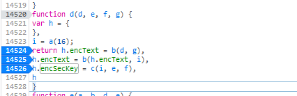

然后开始调试，经过三个断点，h 的变化情况及各参数的值如图：

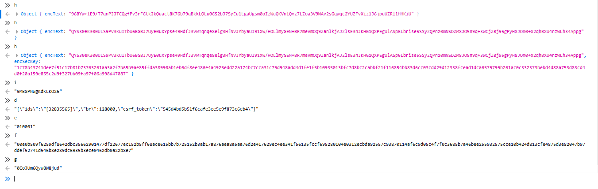

好的，调试到这里，我觉得我已经彻底搞清楚这四个函数了，下面我想结合 JS 代码分析一下：

```javascript
// 函数 a 产生随机 a 位字符串
function a(a) {
    var d,
        e,
        b = 'abcdefghijklmnopqrstuvwxyzABCDEFGHIJKLMNOPQRSTUVWXYZ0123456789',
        c = '';
    for (d = 0; a > d; d += 1) e = Math.random() * b.length,
        e = Math.floor(e),
        c += b.charAt(e);
    return c
}
// 函数 b 为 AES 对称加密过程，返回值为加密结果字符串，
// 参数 a：待加密内容，分别为"{\"ids\":\"[32835565]\",\"br\":128000,\"csrf_token\":\"\"}"和 h.encText；
// 参数 b：密钥，长度 16*2=32 bytes，分别为brA7t(['爱心','女孩','惊恐','大笑'])和 i；
function b(a, b) {
    var c = CryptoJS.enc.Utf8.parse(b),
        d = CryptoJS.enc.Utf8.parse('0102030405060708'),
        e = CryptoJS.enc.Utf8.parse(a),
        // c 是key，也就是密钥，长度为32*4=128 bits，所以可知函数 b 加密方式为 AES-128；
        // d 是iv，也就是初始向量；e 是待加密的内容；
        // f 是加密结果；mode 是加密模式为 CBC
        f = CryptoJS.AES.encrypt(e, c, {
            iv: d,
            mode: CryptoJS.mode.CBC
        });
    return f.toString()
}
// 函数 c 为 RSA 非对称加密过程
// 参数 a：16位随机字符串 为 i；
// 参数 b：6位2进制数字 为brA7t(['流泪','强'])；
// 参数 c：很长的一串，为brA7t(WU9L.md)
function c(a, b, c) {
    var d,
        e;
    return setMaxDigits(131),
        // c 作为公钥 public_key
        // b 是指数
        d = new RSAKeyPair(b, '', c),
        // a 是待加密的字符串
        e = encryptedString(d, a)
}
// 函数 d 得到 h 结果，即 bUK5P 的结果
// 对照图五及图七可以知道函数 d 的每一个参数都是什么，因为每个参数都是固定的
function d(d, e, f, g) {
    var h = {
    },
        // 调用函数 a 得到参数 i
        // i 的结果为一个16位的随机字符串
        i = a(16);

    // 下面的代码为：两次调用函数 b 得到 encText，一次调用函数 c 得到 encSecKey，最后返回结果 h
    return h.encText = b(d, g),
        // 第一次调用 b
        h.encText = b(h.encText, i),
        // 第二次调用 b
        h.encSecKey = c(i, e, f),
        // 调用 c
        h
}
```

### 深入总结

​	调试了这么久，我就通过猜测网易云音乐处理加载音乐请求的过程来总结一下我得到的所有结论吧：

> **处理过程**
>
> - 传输的内容经过 AES 和 RSA 两次加密，每次请求随机产生 16 位随机字符串。
> - 首先对歌曲ID等等信息进行两次 AES-128 加密作为 params
>   - 第一次常量加密
>   - 第二次随机产生 16 位字符串加密
> - 然后对 16 位密钥进行 RSA 加密作为 encSecKey
> - 最后将 encSecKey、params等等传送给服务端
> - 服务端 RSA 解密 encSecKey 得到 16位密钥，再通过密钥解密 params 得到请求信息
> - 服务端返回结果
>
> <b>上述加密过程还有一个别名： 数字信封</b>
>
> **终极结论**
>
> - 首先随机产生的 16 位密钥是随机的，也是网易控制不了的，所以我相信认真阅读的朋友应该也已经恍然大悟了。
> - 我可以一直使用相同的 16 位字符串，那么 encSecKey 也就成了常量，然后我只需要写一个进行 AES加密的函数就可以了。

## Python 实现

### 加密模块实现

首先我规定密钥为：

```txt
ryPnuAVT5RtiIWNi
```

encSecKey为：

```txt
a71973af53caae445b554150da52e75ba5687609d28013aacea03e9ef07169560f156ca76be9ac8df7bb204e05b864756aa3dd2274a65d5be964f118f6d075006695059e10cdcc806306e9a5f2f36f5bf0379f511cd13a600a6cc7031c814583863ea84d3373dea69f74354cd2dc3af61d58eeb43b1de06f588ef361ebc1eed6
```

然后 Python 实现的 AES-128 加密函数为：

```python
from Crypto.Cipher import AES
import base64
import json
key1 = b'0CoJUm6Qyw8W8jud'
key2 = b'ryPnuAVT5RtiIWNi'
content = {"ids": "[32835565]", "br": 128000, "csrf_token": ""}
encSecKey = 'a71973af53caae445b554150da52e75ba5687609d28013aacea03e9ef07169560f156ca76be9ac8df7bb204e05b864756aa3dd2274a65d5be964f118f6d075006695059e10cdcc806306e9a5f2f36f5bf0379f511cd13a600a6cc7031c814583863ea84d3373dea69f74354cd2dc3af61d58eeb43b1de06f588ef361ebc1eed6'
bs = 16  # block size
# 填充方式为：PKCS5
pad = lambda s: s + (bs - len(s) % bs) * chr(bs - len(s) % bs)
encrypt_token = lambda key, content: AES.new(key=key, mode=AES.MODE_CBC, IV=b'0102030405060708').encrypt(pad(content).encode())
if __name__ == '__main__':
    str_content = json.dumps(content)
    tmp = base64.b64encode(encrypt_token(key1, str_content)).decode()
    params = base64.b64encode(encrypt_token(key2, tmp)).decode()
    print(params)
```

计算得到的 params 为：

```txt
9c3ailRGd3aMtbgRQFsMT6ezDBrVvgP9ENnHgTloTgDKutNCCUxwU8qugl7OFqOY6QumjhXlhqTEV4fp4DeoiMoiMSLZFj0t8pbq7rV8Xt/i/ulXVGvKTaN10KfF8QVs
```

接下来使用火狐插件 RESTClient 自行 POST 数据进行验证，如图：

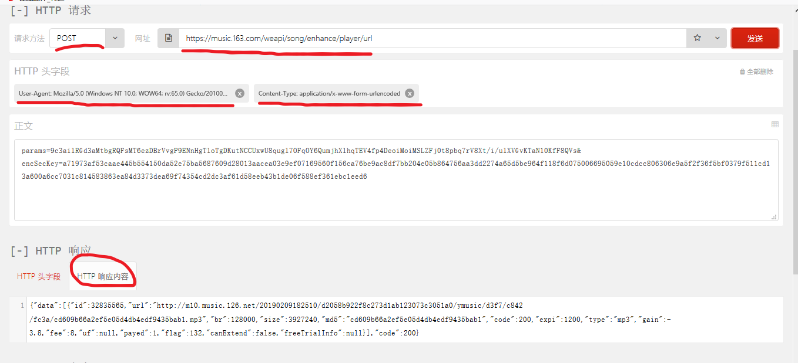

### 简易接口实现

不多说什么，上完整代码，此代码扩展性很强，记得给我点赞哦~

<hr/>

2月10日修改：为满足部分懒人，我加了个直接下载的函数，输入歌曲链接即可下载，至于歌曲名字什么的，懒得写了。

## 后话

​	最后，我想说一下我的感想。

​	各位朋友在看到本文之前可能会疑问为什么网易云音乐网页版无法听无损音质的歌，看完之后各位应该了解了，其实这也是网易为了版权保护而采取的下策。

​	我想，假如非要破解网易云的无损音质下载，那么可能需要逆向网易云音乐的 APK/EXE 构造请求，或者对软件本身进行 Hook 才可以做到吧。

​	当然前提是你要开个会员**（逃不掉哒 :-D ）**

<hr />
