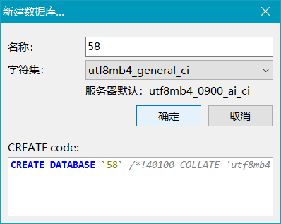

### 环境配置
1. python 3
2. pip install -r requirements
3. mysql 新建数据库，名字随意，格式如图:

### setting.py
1. 修改你的 NAME
2. 修改你的 CITY：
3. 修改你的 DBConf
4. 修改你的默认浏览器UA（不会修改请百度，比如如何得到本机谷歌浏览器的 UA）

### 运行
> 爬取过多会被 58 封IP
> 所以当运行报错的时候，手动打开你的浏览器，
> 随意打开一个**招聘详情页**手动进行验证码验证
> 重新运行 main.py
> 如果被封锁的严重，那么就休息一段时间，不要太短
> 重新运行 main.py

### 使用说明：
1. 每次大概爬取 400-500 条信息会出验证码，你可以选择手动进行验证，
我推荐出三次验证码就不要爬了
2. setting.py 中的 begin 和 end index，
是为了假如你认为你自己爬的太慢，
可以自行分配一些页数给其他人

